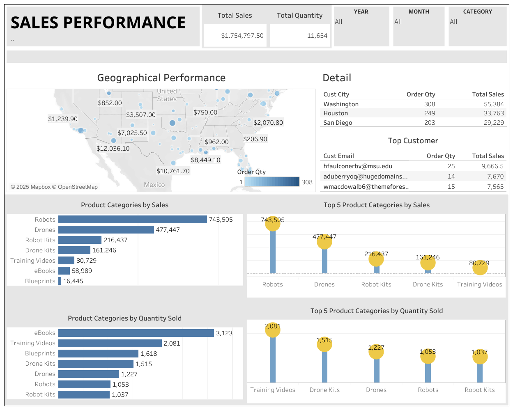

# Project-Based Virtual Intern: Business Intelligence Analyst - Bank Muamalat X Rakamin Academy 🚀

## 📌 Program Overview
Bank Muamalat Indonesia offers a Project-Based Virtual Internship program for aspiring Business Intelligence (BI) Analysts in collaboration with Rakamin Academy. This program provides participants with hands-on experience in data analysis, visualization, and reporting, utilizing tools such as Google BigQuery and Google Data Studio. Interns are tasked with processing raw datasets into insightful dashboards, enabling them to uncover valuable business insights. The program is designed to equip interns with practical skills and knowledge, preparing them for professional roles in the field of business intelligence. 

## 📌 Jobdesk Overview
I participated in the Business Intelligence Analyst Virtual Internship, a project-based program designed to provide real-world experience in the role of a Business Intelligence Analyst in the banking industry, specifically at Bank Muamalat.

The program began with reading materials and video learning sessions, covering fundamental concepts of Business Intelligence, SQL, and data visualization. I also completed several assessments to evaluate my understanding before working on the final project.

Final Project: Business Intelligence for Sales Performance Analysis
As part of the final project, I took on the role of a Business Intelligence Analyst at PT Sejahtera Bersama, where I analyzed sales performance and provided data-driven business recommendations.

What I did:
1. Data preparation – Uploading datasets to PostgreSQL, cleaning and transforming data using SQL queries, establishing relationships between tables, and structuring the database for efficient querying and analysis.
2. Master table creation – Using SQL to build structured tables for analysis.
3. Dashboard development – Designing interactive dashboards in Tableau to visualize sales trends, top product categories, and sales distribution by location.
4. Data analysis & business insights – Providing actionable recommendations to support strategic decision-making.

## Presentation Preview
Click on the image below to open the presentation: 

## 📊 Dashboard Preview 
Click on the image below to open the interactive dashboard:  

## 🛠️ Tools & Technologies Used:
- PostgreSQL – For data storage and SQL queries.
- Tableau – For creating insightful data visualizations.
- GitHub – For storing SQL queries and analysis results.
- Canva – For structuring reports and presentations.
- YouTube – For presenting a project summary video.

Through this experience, I gained a deeper understanding of Business Intelligence workflows and enhanced my skills in SQL, data visualization, and data-driven problem-solving.

Skills: Statistics · Business Acumen · Excel Data Processing · SQL Operation · Data Visualization · BI Tools: Dashboard
